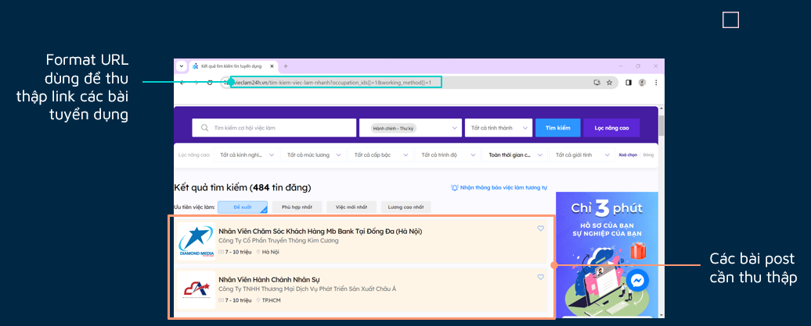
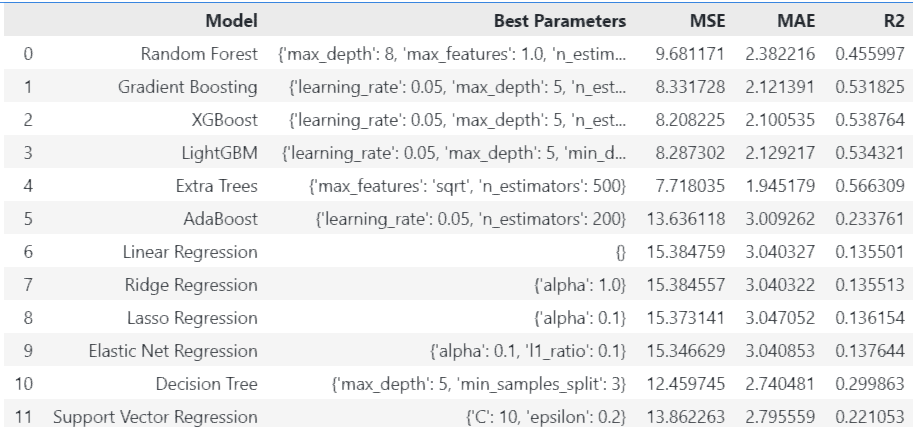

# **Đồ án cuối kì môn Nhập môn Khoa học Dữ liệu**

Người thực hiện: Nhóm 22

## Giới thiệu đồ án

## Môi trường sử dụng

- Ngôn ngữ Python >= 3.9
- Editor: Visual Studio Code, Jupyter Notebook, Google Colab (cho phần thu thập dữ liệu)
- Tổ chức file:
  - `data`: chứa dữ liệu thu thập được và dữ liệu sau khi tiền xử lý
  - `notebooks`: chứa các file mã nguồn theo từng giai đoạn của đồ án
    - 1.0-data-collecting.ipynb: file thu thập dữ liệu
    - 2.0-data-preprocessing.ipynb: file tiền xử lý dữ liệu
    - 3.0-question-and-answer.ipynb: file phân tích dữ liệu qua các câu hỏi đặt ra và trả lời
    - 4.0-modeling.ipynb: file mô hình hóa dữ liệu
  - `Model Deployment`: Cấu hình mô trường triển khai mô hình
    - static: chứa các file css, js, hình ảnh
    - templates: chứa các file html
    - app.py: file chạy chương trình
  - `images`: chứa các hình ảnh minh họa
  - `README.md`: file hướng dẫn sử dụng
  - `requirements.txt`: chứa các thư viện cần thiết để chạy chương trình

## Chi tiết thực hiện

### 1. Thu thập dữ liệu

- Nguồn dữ liệu thu thập từ trang web [Việc làm 24h](https://vieclam24h.vn/tim-kiem-viec-lam-nhanh)
  -Trong phần này, nhóm sử dụng Google Colab để thu thập dữ liệu. Các file thu thập được lưu trong thư mục `data` với tên file là `job_pool.csv` chứa các thông tin là liên kết để xem chi tiết công việc và file `raw_dataset.csv` chứa các thông tin về công việc.

  1.1. Thu thâp liên kết dữ liệu việc làm
  

- Format link: `https://vieclam24h.vn/tim-kiem-viec-lam-nhanh?occupation_ids[]=1&page=2&working_method[]=1`
- Nhóm thiết lập mã code duyệt qua 53 loại công việc và 7 hình thức làm việc khác nhau, duyệt qua tối đa 50 trang để thu thập. Kết quả thu thập hơn 5000 công việc trên khắp cả nước.
- Tiếp theo chúng ta đến từng liên kết công việc để thu thập thông tin chi tiết về công việc đó.
  
- Khi đến từng trang công việc thu thập các thông tin từ nhà tuyển dụng, đến các yêu cầu của họ (nằm trong mục thông tin chung) và các thông tin liên quan.

### 2. Tiền xử lý dữ liệu

Khi dữ liệu thu thập hoàn chình nhưng chưa thể sử dụng được, chúng ta cần phải tiền xử lý dữ liệu để có thể sử dụng được. Trong phần này, nhóm sẽ áp dụng các bước tiền xử lý dữ liệu để tạo thành những dữ liệu có thể sử dụng được.

2.1. Xóa những cột không cần thiết: Một số cột trong dữ liệu thu thập được những không theo format chung hoặc không cần thiết sẽ bị nhóm loại bỏ khỏi dữ liệu.

- Một số cột bị loại bỏ là :`'Liên kết','Tên công ty','Tên công việc', 'Mô tả công việc', 'Quyền lợi', 'Yêu cầu công việc', 'Từ khóa','Địa điểm làm việc', 'Địa chỉ công ty'`.

  2.2. Xử lý dữ liệu theo cột

- Tên công ty: Dựa vào tên công ty, nhóm sẽ chia thành thành `Công ty trách nhiệm hữu hạn` và `Công ty cổ phần` sau đó loại bỏ cột tên công ty và thay vào đó là cột `Loại công ty`.
- Mức lương: Dựa vào mức lương, nhóm sẽ loại bỏ những giá trị mang tên là ` Thỏa thuận`. Nhưng dữ liệu thô thường có dạng `8 - 15 triệu`. Do đó nhóm sẽ tách ra thành ` Mức lương thấp nhất`, `Mức lương cao nhất` và `Mức lương trung bình` để có thể sử dụng được.
- Thời gian thử việc: Nhóm sẽ tiền hành tách số và chuyển cột này thành kiển float.
- Yêu cầu giới tính: Một số công việc yêu cầu giời tính cụ thể, nhưng một số không yêu cầu giới tính nên dữ liệu thô không có giá trị. Nhóm sẽ thay thế giá trị này bằng `Không yêu cầu`.
- Yêu cầu bằng cấp: Những dữ liệu không có giá trị sẽ được thay thế bằng `Không`.
- Yêu cầu độ tuổi: Tương tự như ` Mức lương`, nhóm sẽ tách ra thành `Tuổi thấp nhất` và `Tuổi cao nhất` , `Tuổi trung bình` để có thể sử dụng được.

=> Cuối cùng kiểm tra dữ liệu trùng lặp và xóa nó đi.

2.2. Xử lý dữ liệu nhiễu và thiếu

- Kiểm tra dữ liệu bị thiếu
  
- Chỉ có cột về tuổi và thời gian thử việc là còn thiếu dữ liệu
- Xử lý dữ liệu thiếu có nhiều cách, nhóm em quyết định xử lý bằng cách áp dụng thuật toán học máy KNN để dự đoán giá trị thiếu.

  - Tiền xử lý bằng `Label Encoder`, đối với những cột như `Ngành nghề` và `Khu vực tuyển` có định dạng dữ liệu là `MutilLabel`, nhóm sẽ dùng `MutilLabelBinarizer` để chuyển đổi dữ liệu về dạng số (có tác dụng như One Hot Encoder).

- Trước khi KNN
  

- Sau khi KNN
  
- Nguyên nhân vẫn còn dữ liệu thiếu sau khi KNN là không có người hàng xóm nào xung quanh dữ liệu ấy nên không thể dự đoán đươc. Do đó nhóm sẽ loại bỏ luôn những dữ liệu này.

  2.2. Xử lý dữ liệu nhiễu

- Ở phần này nhóm chủ yếu phân tích mức lương

- Có thể thấy có rất nhiều outliers trong dữ liệu mức lương. Nguyên nhân chính là nhà tuyển dụng đưa ra khoảng lương rất lớn nên khi lấy trung bình thì dữ liệu có nhiều outliers, Do đó để trảnh ảnh hưởng đến phân tích và mô hình dữ liệu sau này nhóm sẽ áp dụng IQR để loại bỏ những outliers này.

=> Cuối cùng dữ liệu được lưu vào file `data/cleaned_dataset.csv`

### 3. Phân tích dữ liệu qua các câu hỏi đặt ra và trả lời

### 4. Mô hình hóa dữ liệu

- Ở phần này nhóm áp dụng những mô hình học máy đơn giản của thư viện sci-kit learn để tạo ra mô hình dự đoán mức lương.
  4.1. Tiền xử lý dữ liệu
  
- Nhóm sẽ tiền xử lý những cột mutil label bằng cách đối với Khu vực tuyển, nhóm sẽ nhân thành nhiều dòng, mỗi dòng ứng với mỗi khu vực tuyển.
- Đối với cột ngành nghề, nhận thấy chỉ có tối đa 3 ngành nghề trong 1 cột dữ liệu nhóm sẽ thành ra thành 3 cột tương ứng: `Ngành nghề chính, Nghề liên quan 1, Nghề liên quan 2.`
- sau cùng đổi tên các cột sang kiểu tiêu chuẩn tiếng anh để phân tích tiếp.

  4.2.Trích xuất đặc trưng

- Không phải cột nào cũng ảnh hưởng đến cột Lương trung bình. Do đó phải qua các bước để đánh giá những cột nào có thể ảnh hưởng đến cột mục tiêu. Dựa vào mức kỳ vọng p-value để đánh giá xem cột đó có ảnh hưởng đến cột mục tiêu hay không.
-
- Đổi với những cột có dữ liệu phân loại, Nhóm sẽ áp dụng `ANOVA` để đánh giá xem cột đó có ảnh hưởng đến cột mục tiêu hay không.

- Kết quả có 10/11 cột ảnh hưởng đến mức lương, chỉ có cột loại công ty thì không ảnh hưởng.

-Đối với những cột số nhóm chạy mô hình `Pearson` để đánh giá xem cột đó có ảnh hưởng đến cột mục tiêu hay không.

- Kết quả chỉ có cột số lượng tuyển không ảnh hưởng đến cột mục tiêu.

  4.3. Chuẩn bị dữ liệu
  

  4.4. Mô hình hóa
  

  4.5. So sánh kết quả các mô hình
  

- Đánh giá mô hình

- Nhận xét kết quả:
  

### 5. Triển khai mô hình

Nhận thấy mô hình `Extra Tree` có hiệu suất tốt nhất nên chúng em quyết định áp dựng model này vào phần triển khai để áp dụng vào thực tế.

- Lưu dữ liệu lại vào `models/Extra Tree.pkl`. Đồng thời cũng lưu những nhãn dữ liệu mã vào vào file `models/*.pkl` để khi triển khai mô hình có thể chuyển đổi dữ liệu về dạng số để dự đoán.

- Nhóm em quyết định triển khai thư mục bằng Flask để tạo nên trang web có thể tương tác và đưa ra dự đoán mức lương cho người dùng.
- Trang web có chức năng chính là: Cho người dùng chọn dứng Option mà nó đã được lưu vào models trước đó `Những cột phân loại` cũng như được nhập `Các cột số` để dự đoán mức lương mà người dùng có thể offer khi tuyển dụng hoặc thương lượng với nhà tuyển dụng của mình.
- Cách chạy: Vào trực tiếp thư mục `Model Deployment` và chạy câu lệnh `python app.py` để chạy chương trình, sử dụng trình duyệt web vào port `http://127.0.0.1:5000/` để xem kết quả
- Kết quả:
  
  

## Tác giả

- [Nhóm 22](https://github.com/HungLVT/NMKHDL.git)

## Liên hệ

- [Nguyễn Văn Quang Hưng] hung133003@gmail.com
- [Huỳnh Trí Nhân]
- [Chiêm Bỉnh Nguyên]
- [Huỳnh Thị Kiều Hoa]
