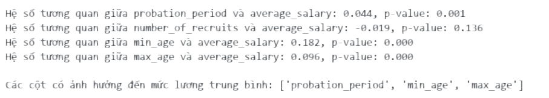

# **Đồ án cuối kì môn Nhập môn Khoa học Dữ liệu**

Người thực hiện: Nhóm 22

## Giới thiệu đồ án
Trong bối cảnh nền kinh tế suy thoái, song song với đó là thời đại công nghệ 4.0 với sự bùng nổ của công nghệ và dữ liệu, việc sử dụng phương pháp khoa học dữ liệu để đánh giá thị trường việc làm trở nên ngày càng quan trọng.

Đồ án này được nhóm thực hiện nhằm cung cấp cho người lao động một cái nhìn toàn diện về nhu cầu việc làm tại Việt Nam (mức lương, bằng cấp, khu vực,...), giúp họ có những chiến lược về việc làm phù hợp cho bản thân.
## Môi trường sử dụng

- Ngôn ngữ Python >= 3.9
- Editor: Visual Studio Code, Jupyter Notebook, Google Colab (cho phần thu thập dữ liệu)
- Tổ chức file:
  - `data`: chứa dữ liệu thu thập được và dữ liệu sau khi tiền xử lý
  - `notebooks`: chứa các file mã nguồn theo từng giai đoạn của đồ án
    - 1.0-data-collecting.ipynb: file thu thập dữ liệu
    - 2.0-data-preprocessing.ipynb: file tiền xử lý dữ liệu
    - 3.0-question-and-answer.ipynb: file phân tích dữ liệu qua các câu hỏi đặt ra và trả lời
    - 4.0-modeling.ipynb: file mô hình hóa dữ liệu
  - `Model Deployment`: Cấu hình mô trường triển khai mô hình
    - static: chứa các file css, js, hình ảnh
    - templates: chứa các file html
    - app.py: file chạy chương trình
  - `images`: chứa các hình ảnh minh họa
  - `README.md`: file hướng dẫn sử dụng
  - `requirements.txt`: chứa các thư viện cần thiết để chạy chương trình

## Chi tiết thực hiện

### 1. Thu thập dữ liệu

- Nguồn dữ liệu thu thập từ trang web [Việc làm 24h](https://vieclam24h.vn/tim-kiem-viec-lam-nhanh)
  -Trong phần này, nhóm sử dụng Google Colab để thu thập dữ liệu. Các file thu thập được lưu trong thư mục `data` với tên file là `job_pool.csv` chứa các thông tin là liên kết để xem chi tiết công việc và file `raw_dataset.csv` chứa các thông tin về công việc.

  1.1. Thu thập liên kết dữ liệu việc làm
  

- Format link: `https://vieclam24h.vn/tim-kiem-viec-lam-nhanh?occupation_ids[]=1&page=2&working_method[]=1`
- Nhóm thiết lập mã code duyệt qua 53 loại công việc và 7 hình thức làm việc khác nhau, duyệt qua tối đa 50 trang để thu thập. Kết quả thu thập hơn 5000 công việc trên khắp cả nước.
- Tiếp theo chúng ta đến từng liên kết công việc để thu thập thông tin chi tiết về công việc đó.
  
- Khi đến từng trang công việc thu thập các thông tin từ nhà tuyển dụng, đến các yêu cầu của họ (nằm trong mục thông tin chung) và các thông tin liên quan.

### 2. Tiền xử lý dữ liệu

Khi dữ liệu thu thập hoàn chình nhưng chưa thể sử dụng được, chúng ta cần phải tiền xử lý dữ liệu để có thể sử dụng được. Trong phần này, nhóm sẽ áp dụng các bước tiền xử lý dữ liệu để tạo thành những dữ liệu có thể sử dụng được.

2.1. Xóa những cột không cần thiết: Một số cột trong dữ liệu thu thập được những không theo format chung hoặc không cần thiết sẽ bị nhóm loại bỏ khỏi dữ liệu.

- Một số cột bị loại bỏ là :`'Liên kết', 'Tên công ty', 'Tên công việc', 'Mô tả công việc', 'Quyền lợi', 'Yêu cầu công việc', 'Từ khóa', 'Địa điểm làm việc', 'Địa chỉ công ty'`

  2.2. Xử lý dữ liệu theo cột

- Tên công ty: Dựa vào tên công ty, nhóm sẽ chia thành thành `Công ty trách nhiệm hữu hạn` và `Công ty cổ phần` sau đó loại bỏ cột tên công ty và thay vào đó là cột `Loại công ty`
- Mức lương: Dựa vào mức lương, nhóm sẽ loại bỏ những giá trị mang tên là ` Thỏa thuận`. Nhưng dữ liệu thô thường có dạng `8 - 15 triệu`. Do đó nhóm sẽ tách ra thành ` Mức lương thấp nhất`, `Mức lương cao nhất` và `Mức lương trung bình` để có thể sử dụng được.
- Thời gian thử việc: Nhóm sẽ tiến hành tách số và chuyển cột này thành kiểu float.
- Yêu cầu giới tính: Một số công việc yêu cầu giới tính cụ thể, nhưng một số không yêu cầu giới tính nên dữ liệu thô không có giá trị. Nhóm sẽ thay thế giá trị này bằng `Không yêu cầu`
- Yêu cầu bằng cấp: Những dữ liệu không có giá trị sẽ được thay thế bằng `Không`
- Yêu cầu độ tuổi: Tương tự như `Mức lương`, nhóm sẽ tách ra thành `Tuổi thấp nhất` và `Tuổi cao nhất` , `Tuổi trung bình` để có thể sử dụng được.

=> Cuối cùng kiểm tra dữ liệu trùng lặp và xóa nó đi.

2.2. Xử lý dữ liệu nhiễu và thiếu

- Kiểm tra dữ liệu bị thiếu
  
- Chỉ có cột về tuổi và thời gian thử việc là còn thiếu dữ liệu
- Xử lý dữ liệu thiếu có nhiều cách, nhóm em quyết định xử lý bằng cách áp dụng thuật toán học máy KNN để dự đoán giá trị thiếu.

  - Tiền xử lý bằng `Label Encoder`, đối với những cột như `Ngành nghề` và `Khu vực tuyển` có định dạng dữ liệu là `MutilLabel`, nhóm sẽ dùng `MutilLabelBinarizer` để chuyển đổi dữ liệu về dạng số (có tác dụng như One Hot Encoder).

- Trước khi KNN
  

- Sau khi KNN
  
- Nguyên nhân vẫn còn dữ liệu thiếu sau khi KNN là không có người hàng xóm nào xung quanh dữ liệu ấy nên không thể dự đoán đươc. Do đó nhóm sẽ loại bỏ luôn những dữ liệu này.

  2.2. Xử lý dữ liệu nhiễu

- Ở phần này nhóm chủ yếu phân tích mức lương

- Có thể thấy có rất nhiều outliers trong dữ liệu mức lương. Nguyên nhân chính là nhà tuyển dụng đưa ra khoảng lương rất lớn nên khi lấy trung bình thì dữ liệu có nhiều outliers. Do đó để tránh ảnh hưởng đến phân tích và mô hình dữ liệu sau này nhóm sẽ áp dụng IQR để loại bỏ những outliers này.

=> Cuối cùng dữ liệu được lưu vào file `data/cleaned_dataset.csv`

### 3. Phân tích dữ liệu qua các câu hỏi đặt ra và trả lời

  
<b>Câu hỏi 1. Ngành nghề nào có nhiều công việc với mức lương cao nhất?
</b>

<b>Mục đích của câu hỏi: </b>  Giúp người quan tâm về vấn đề tuyển dụng biết được nhu cầu việc làm của các ngành nghề đối với các công việc có mức lương cao

<b>Cách trả lời câu hỏi: </b>

* Có 3 bước:

    * *Bước 1*: Lọc ra các công việc có thu nhập cao (ngưỡng là phân vị 75% mức lương trung bình)
    
    * *Bước 2*: Tính tỉ lệ công việc lương cao ở các ngành nghề, vẽ biểu đồ top 10

    * *Bước 3*: Trực quan hoá

<b>Kết quả các bước làm: </b>Biểu đồ cột và đường thể hiện ngành nghề có có tỉ lệ mức lương cao là lớn nhất

<b>Bước 1: Lọc ra các công việc có thu nhập cao</b> : 

  <b>
Giá trị ngưỡng tìm được là: 15.0 triệu</b>

  

<b>Bước 2: Tính tỉ lệ công việc lương cao ở các ngành nghề, vẽ biểu đồ top 10
</b>

<table border="1" class="dataframe">
<caption><b>Bảng tỉ lệ công việc có lương cao trong các ngành(Lấy ra 5 ngành có tỉ lệ cao nhất)</b></caption>
  <thead>
    <tr style="text-align: right;">
      <th></th>
      <th>Ngành nghề</th>
      <th>Tổng số lượng tuyển</th>
      <th>Tỉ lệ công việc lương cao</th>
    </tr>
  </thead>
  <tbody>
    <tr>
      <th>0</th>
      <td>Khai thác năng lượng - Khoáng sản - Địa chất</td>
      <td>18</td>
      <td>61.111111</td>
    </tr>
    <tr>
      <th>1</th>
      <td>Quản lý dự án</td>
      <td>343</td>
      <td>58.017493</td>
    </tr>
    <tr>
      <th>2</th>
      <td>Chăn nuôi - Thú y</td>
      <td>68</td>
      <td>52.941176</td>
    </tr>
    <tr>
      <th>3</th>
      <td>Bảo hiểm</td>
      <td>236</td>
      <td>50.423729</td>
    </tr>
    <tr>
      <th>4</th>
      <td>Luật - Pháp Lý - Tuân thủ</td>
      <td>238</td>
      <td>49.159664</td>
    </tr>
  </tbody>
</table>

<b>Bước 3: Trực quan hoá
</b>

<b>=>Trả lời câu hỏi
</b>

* Marketing và xây dựng là những ngành nghề vừa có nhu cầu tuyển dụng nhiều vừa có tỉ lệ lương cao.

* Các ngành Địa chất, Chăn nuôi – Thú y, Bảo hiểm, Quản lý dự án, Xuất bản – in ấn có tỉ lệ lương rất cao nhưng lại có ít nhu cầu tuyển dụng do chuyên môn đặc thù, đòi hỏi kinh nghiệm và chuyên gia hoặc do ảnh hưởng của công nghệ.

  

    
<b>Câu hỏi 2. Có sự khác biệt trong lương đối với người có kinh nghiệm, bằng cấp khác nhau hay không?
</b>

<b>Mục đích của câu hỏi: </b>  Giúp người tìm việc làm hiểu được nhu cầu của thị trường có phù hợp với trình độ của mình hay không

<b>Cách trả lời câu hỏi: </b>

* Có 3 bước:
    * *Bước 1*: Đầu tiên, ta lọc các giá trị có ít dữ liệu trong dataset, như giá trị `4 năm`, `Hơn 5 năm` trong cột `Yêu cầu kinh nghiệm` và giá trị `Trên đại học`, `Chứng chỉ` trong cột `Yêu cầu bằng cấp`
    
    * *Bước 2*: Ta sẽ xử lí lọc các giá trị ngoại lại trong cột mức lương trung bình

    * *Bước 3*: Vẽ biểu đồ boxplot cho các dữ liệu đã được lọc

    

<b>Kết quả các bước làm: </b>Biểu đồ boxplot về mức lương trung bình được groupby theo cột `Yêu cầu bằng cấp` và `Yêu cầu kinh nghiệm`

<b>Bước 1: Lọc các giá trị xuất hiện rất ít trong bộ dữ liệu
</b>

  <b>
* Các giá trị được lọc ra trong `Yêu cầu bằng cấp` là `Chứng chỉ`,`Trên đại học`

* Các giá trị được lọc ra trong `Yêu cầu kinh nghiệm` là `Hơn 4 năm`,`4 năm`
</b>

<b>Bước 2: Lọc các giá ngoại lại trong cột 'Mức lương trung bình'
</b>

<table border="1" class="dataframe">
<caption><b> Bảng dữ liệu sau khi lọc các giá trị ngoại lai</b></caption>
  <thead>
    <tr style="text-align: right;">
      <th></th>
      <th>Khu vực tuyển</th>
      <th>Thời gian thử việc</th>
      <th>Cấp bậc</th>
      <th>Yêu cầu giới tính</th>
      <th>Số lượng tuyển</th>
      <th>Hình thức làm việc</th>
      <th>Yêu cầu bằng cấp</th>
      <th>Yêu cầu kinh nghiệm</th>
      <th>Ngành nghề</th>
      <th>Quy mô công ty</th>
      <th>Loại công ty</th>
      <th>Mức lương thấp nhất</th>
      <th>Mức lương cao nhất</th>
      <th>Mức lương trung bình</th>
      <th>Tuổi thấp nhất</th>
      <th>Tuổi cao nhất</th>
      <th>Tuổi trung bình</th>
    </tr>
  </thead>
  <tbody>
    <tr>
      <th>560</th>
      <td>TP.HCM</td>
      <td>1.8</td>
      <td>Cộng tác viên</td>
      <td>Không yêu cầu</td>
      <td>5</td>
      <td>Bán thời gian cố định</td>
      <td>Không</td>
      <td>Chưa có kinh nghiệm</td>
      <td>Kế toán/Thực tập sinh/Hành chính - Thư ký</td>
      <td>Trên 300 người</td>
      <td>Công ty trách nhiệm hữu hạn</td>
      <td>1.0</td>
      <td>3.0</td>
      <td>2.0</td>
      <td>22.0</td>
      <td>36.0</td>
      <td>29.0</td>
    </tr>
    <tr>
      <th>315</th>
      <td>Long An</td>
      <td>2.0</td>
      <td>Chuyên viên- nhân viên</td>
      <td>Không yêu cầu</td>
      <td>1</td>
      <td>Toàn thời gian cố định</td>
      <td>Trung cấp</td>
      <td>Chưa có kinh nghiệm</td>
      <td>Hành chính - Thư ký/Biên phiên dịch</td>
      <td>Trên 300 người</td>
      <td>Công ty cổ phần</td>
      <td>14.0</td>
      <td>25.0</td>
      <td>19.5</td>
      <td>22.0</td>
      <td>35.0</td>
      <td>28.5</td>
    </tr>
    <tr>
      <th>524</th>
      <td>TP.HCM</td>
      <td>1.8</td>
      <td>Chuyên viên- nhân viên</td>
      <td>Không yêu cầu</td>
      <td>2</td>
      <td>Toàn thời gian cố định</td>
      <td>Trung cấp</td>
      <td>1 năm</td>
      <td>Kế toán/Thu mua - Kho Vận - Chuỗi cung ứng/Hàn...</td>
      <td>10 - 150 người</td>
      <td>Công ty trách nhiệm hữu hạn</td>
      <td>8.0</td>
      <td>10.0</td>
      <td>9.0</td>
      <td>23.0</td>
      <td>35.0</td>
      <td>29.0</td>
    </tr>
    <tr>
      <th>3538</th>
      <td>TP.HCM</td>
      <td>1.6</td>
      <td>Chuyên viên- nhân viên</td>
      <td>Không yêu cầu</td>
      <td>2</td>
      <td>Toàn thời gian cố định</td>
      <td>Cao đẳng</td>
      <td>3 năm</td>
      <td>Kế toán/Kiểm toán/Tài chính - Đầu tư - Chứng K...</td>
      <td>10 - 150 người</td>
      <td>Công ty trách nhiệm hữu hạn</td>
      <td>9.0</td>
      <td>10.0</td>
      <td>9.5</td>
      <td>23.0</td>
      <td>40.0</td>
      <td>31.5</td>
    </tr>
    <tr>
      <th>2849</th>
      <td>Gia Lai</td>
      <td>2.0</td>
      <td>Chuyên viên- nhân viên</td>
      <td>Không yêu cầu</td>
      <td>1</td>
      <td>Toàn thời gian cố định</td>
      <td>Trung học</td>
      <td>Chưa có kinh nghiệm</td>
      <td>Bán hàng - Kinh doanh/Tài chính - Đầu tư - Chứ...</td>
      <td>Trên 300 người</td>
      <td>Công ty trách nhiệm hữu hạn</td>
      <td>15.0</td>
      <td>25.0</td>
      <td>20.0</td>
      <td>25.0</td>
      <td>40.0</td>
      <td>32.5</td>
    </tr>
  </tbody>
</table>

    
<b>Bước 3: Trực quan hoá
</b>

<b>=>Trả lời câu hỏi
</b>

* Ở biểu đồ về <b>Kinh nghiệm</b>, dễ dàng nhận thấy với kinh nghiệm càng cao thì mức lương nhận được càng cao
* Ở biểu đồ về <b>Bằng cấp</b>, với bằng đại học thì mức lương được trỉa rộng nhất và cao nhất, các bằng cấp còn lại không khác biệt nhiều

  

    
<b>Câu hỏi 3. Khác biệt trong nhu cầu tuyển dụng ở các tỉnh thành khác nhau ?
</b>

<b>Mục đích của câu hỏi: </b>  Cho người tìm việc làm hiểu được nhu cầu của thị trường ở các địa phương cụ thể

<b>Cách trả lời câu hỏi: </b>

* Có 3 bước:

    *  *Bước 1*: Lần lượt tách tất cả các hàng dữ liệu khi tại hàng đó và cột cụ thể có chứa hơn 1 giá trị, ví dụ ở cột `Khu vực tuyển` có các hàng có giá trị là nhiều hơn 1 tỉnh, để làm việc này, nhóm sẽ tách các giá trị ở các hàng trong một cột theo giá trị ngăn cách như `/` hoặc `, `. Sau đó sẽ explode theo cột.

    *  *Bước 2*: Gom nhóm theo các cột dữ liệu `Khu vực tuyển`, `Ngành nghề`,và tính tổng ở cột `Số lượng tuyển` sau đó so sánh số lượng tuyển các ngành ở các tỉnh thành cụ thể. Ở đây nhóm sẽ xem xét ở 5 khu vực tuyển có số lượng tuyển nhiều nhất

    * *Bước 3*: Vẽ 5 biểu đồ cột để so sánh, vì có rất nhiều ngành nghề nên nhóm chỉ trực quan ở 5 ngành nghề có số lượng tuyển cao nhất

<b>Kết quả các bước làm: </b>5 biểu đồ cột đôi so sánh số lượng tuyển của các ngành nghề

<b>Bước 1: Tách các cột dữ liệu
</b>

  <b>
Tách các cột dữ liệu `Ngành nghề` và `Khu vực tuyển` thành các giá trị riêng biệt
</b>

<table border="1" class="dataframe">
<caption><b>Bảng dữ liệu sau khi tách</b></caption>

  <thead>
    <tr style="text-align: right;">
      <th></th>
      <th>Khu vực tuyển</th>
      <th>Thời gian thử việc</th>
      <th>Cấp bậc</th>
      <th>Yêu cầu giới tính</th>
      <th>Số lượng tuyển</th>
      <th>Hình thức làm việc</th>
      <th>Yêu cầu bằng cấp</th>
      <th>Yêu cầu kinh nghiệm</th>
      <th>Ngành nghề</th>
      <th>Quy mô công ty</th>
      <th>Loại công ty</th>
      <th>Mức lương thấp nhất</th>
      <th>Mức lương cao nhất</th>
      <th>Mức lương trung bình</th>
      <th>Tuổi thấp nhất</th>
      <th>Tuổi cao nhất</th>
      <th>Tuổi trung bình</th>
    </tr>
  </thead>
  <tbody>
    <tr>
      <th>7072</th>
      <td>Bắc Ninh</td>
      <td>1.8</td>
      <td>Chuyên viên- nhân viên</td>
      <td>Nam</td>
      <td>10</td>
      <td>Toàn thời gian cố định</td>
      <td>Trung cấp</td>
      <td>Chưa có kinh nghiệm</td>
      <td>Khoa học - Kỹ thuật</td>
      <td>Trên 300 người</td>
      <td>Công ty trách nhiệm hữu hạn</td>
      <td>8.0</td>
      <td>10.0</td>
      <td>9.0</td>
      <td>25.0</td>
      <td>36.0</td>
      <td>30.5</td>
    </tr>
    <tr>
      <th>15092</th>
      <td>Hải Phòng</td>
      <td>0.5</td>
      <td>Chuyên viên- nhân viên</td>
      <td>Nữ</td>
      <td>1</td>
      <td>Toàn thời gian cố định</td>
      <td>Đại học</td>
      <td>Chưa có kinh nghiệm</td>
      <td>Công nghệ thực phẩm - Dinh dưỡng</td>
      <td>150 - 300 người</td>
      <td>Công ty trách nhiệm hữu hạn</td>
      <td>8.0</td>
      <td>12.0</td>
      <td>10.0</td>
      <td>21.0</td>
      <td>45.0</td>
      <td>33.0</td>
    </tr>
    <tr>
      <th>8895</th>
      <td>TP.HCM</td>
      <td>2.0</td>
      <td>Chuyên viên- nhân viên</td>
      <td>Không yêu cầu</td>
      <td>10</td>
      <td>Toàn thời gian cố định</td>
      <td>Cao đẳng</td>
      <td>Dưới 1 năm</td>
      <td>Ngân hàng</td>
      <td>Trên 300 người</td>
      <td>Công ty trách nhiệm hữu hạn</td>
      <td>8.0</td>
      <td>20.0</td>
      <td>14.0</td>
      <td>22.0</td>
      <td>35.0</td>
      <td>28.5</td>
    </tr>
    <tr>
      <th>6156</th>
      <td>TP.HCM</td>
      <td>2.0</td>
      <td>Chuyên viên- nhân viên</td>
      <td>Không yêu cầu</td>
      <td>1</td>
      <td>Toàn thời gian cố định</td>
      <td>Đại học</td>
      <td>2 năm</td>
      <td>IT Phần mềm</td>
      <td>Dưới 10 người</td>
      <td>Công ty trách nhiệm hữu hạn</td>
      <td>12.0</td>
      <td>25.0</td>
      <td>18.5</td>
      <td>25.0</td>
      <td>45.0</td>
      <td>35.0</td>
    </tr>
    <tr>
      <th>4312</th>
      <td>TP.HCM</td>
      <td>1.6</td>
      <td>Chuyên viên- nhân viên</td>
      <td>Không yêu cầu</td>
      <td>10</td>
      <td>Toàn thời gian cố định</td>
      <td>Cao đẳng</td>
      <td>1 năm</td>
      <td>Bán sỉ - Bán lẻ - Quản lý cửa hàng</td>
      <td>10 - 150 người</td>
      <td>Công ty trách nhiệm hữu hạn</td>
      <td>15.0</td>
      <td>20.0</td>
      <td>17.5</td>
      <td>23.0</td>
      <td>34.0</td>
      <td>28.5</td>
    </tr>
  </tbody>
</table>

<b>Bước 2: Gom nhóm dữ liệu theo `Khu vực tuyển` và `Ngành nghề`, lấy tổng ở cột ` Số lượng tuyển`
</b>

<table border="1" class="dataframe">
  <caption><b>Bảng dữ liệu số lượng tuyển theo tưng ngành nghề và khu vực tuyển</b></caption>
  <thead>
    <tr style="text-align: right;">
      <th></th>
      <th>Khu vực tuyển</th>
      <th>Ngành nghề</th>
      <th>Số lượng tuyển</th>
    </tr>
  </thead>
  <tbody>
    <tr>
      <th>1309</th>
      <td>Vĩnh Phúc</td>
      <td>Ngân hàng</td>
      <td>116</td>
    </tr>
    <tr>
      <th>1256</th>
      <td>Tây Ninh</td>
      <td>Quản lý dự án</td>
      <td>5</td>
    </tr>
    <tr>
      <th>272</th>
      <td>Bắc Ninh</td>
      <td>Xuất Nhập Khẩu</td>
      <td>9</td>
    </tr>
    <tr>
      <th>532</th>
      <td>Hải Dương</td>
      <td>Bảo hiểm</td>
      <td>15</td>
    </tr>
    <tr>
      <th>1214</th>
      <td>Trà Vinh</td>
      <td>Ngân hàng</td>
      <td>33</td>
    </tr>
    <tr>
      <th>883</th>
      <td>Phú Thọ</td>
      <td>Xây dựng</td>
      <td>2</td>
    </tr>
    <tr>
      <th>115</th>
      <td>Bình Phước</td>
      <td>An ninh - Bảo vệ</td>
      <td>2</td>
    </tr>
    <tr>
      <th>1448</th>
      <td>Đồng Nai</td>
      <td>Khoa học - Kỹ thuật</td>
      <td>65</td>
    </tr>
    <tr>
      <th>846</th>
      <td>Ninh Bình</td>
      <td>Kế toán</td>
      <td>6</td>
    </tr>
    <tr>
      <th>36</th>
      <td>Bà Rịa - Vũng Tàu</td>
      <td>Dược phẩm</td>
      <td>77</td>
    </tr>
  </tbody>
</table>

    
<b>Bước 3: Trực quan hoá
</b>

<b>=>Trả lời câu hỏi
</b>

* Biểu đồ cho thấy giống như biểu đồ về tuyển dụng các ngành ở phần khám phá, ngành <b>Bán hàng - kinh doanh, Hành chính - Thư ký, Chăm sóc khách hàng </b> luôn có số lượng tuyển cao ở các tỉnh.

* Ngành <b>Khách sạn - Nhà hàng - Du lịch </b> xuất hiện ở 4/5 biểu đồ dù không phải nằm trong top 10 ngành có số lượng tuyển nhiều nhất cả nước

* Tại tỉnh <b>Long An</b>, <b> Nghề nghiệp khác</b> chiếm số lượng tuyển khá lớn - Đứng thứ 2 trong toàn bộ số lượng tuyển

* Các ngành nghề <b>Lao động phổ thông, Chăm sóc khách hàng</b> cũng có xuất hiện dù không nằm trong top 10 toàn quốc

  

    
<b>Câu hỏi 4. Với độ tuổi cụ thể, người lao động có thể tìm đến những việc làm nào và tiền lương có thể nhận được là bao nhiêu ?
</b>

<b>Mục đích của câu hỏi: </b>  Giúp người lao động có thể tìm việc phù hợp với độ tuổi và lương mong muốn

<b>Cách trả lời câu hỏi: </b>

* Có 4 bước:

    * *Bước 1*: Xem xét biểu đố histogram của cột tuổi, tiến hành chia lại thành các nhóm tuổi `16-25`, `26-30`, `31-60` và lưu vào cột mới là `Nhóm tuổi`

    * *Bước 2*: Tách các hàng mang nhiều giá trị trong cột `Ngành nghề`, dùng explode để tách
    
    * *Bước 3*: Tạo bảng để tính số lượng cho mỗi `Ngành nghề` và `Nhóm tuổi`

    * *Bước 4*: Vẽ biểu đồ cột nhiều màu để so sánh, đồng thời biểu diễn lương trung bình bên cạnh mỗi màu trong cột
    

<b>Kết quả các bước làm: </b>Biểu đồ cột đôi so sánh mức lương của nam và nữ trong cùng một điều kiện ở 5 ngành nghề có số lượng tuyển nhiều nhất

<b>Bước 1: Xem xét histogram độ tuổi và chia lại các bins
</b>

<b>Lựa chọn các bins như sau `16-25`, `26-30`, `31-60` và lưu vào cột mới là `Nhóm tuổi`
</b>

<b>Bước 2: Tách cột ngành nghề thành các ngành nghề cụ thể
</b>

<b>Bước 3: Tạo bảng để tính số lượng cho mỗi `Ngành nghề` và `Nhóm tuổi`

</b>

<table border="1" class="dataframe">
<caption><b>Bảng ngành nghề theo nhóm tuổi</b></caption>
  <thead>
    <tr style="text-align: right;">
      <th>Nhóm tuổi</th>
      <th>16-25</th>
      <th>26-30</th>
      <th>31-60</th>
    </tr>
    <tr>
      <th>Ngành nghề</th>
      <th></th>
      <th></th>
      <th></th>
    </tr>
  </thead>
  <tbody>
    <tr>
      <th>An ninh - Bảo vệ</th>
      <td>1</td>
      <td>15</td>
      <td>42</td>
    </tr>
    <tr>
      <th>An toàn lao động</th>
      <td>1</td>
      <td>8</td>
      <td>11</td>
    </tr>
    <tr>
      <th>Biên phiên dịch</th>
      <td>7</td>
      <td>100</td>
      <td>52</td>
    </tr>
    <tr>
      <th>Bán hàng - Kinh doanh</th>
      <td>250</td>
      <td>934</td>
      <td>464</td>
    </tr>
    <tr>
      <th>Bán sỉ - Bán lẻ - Quản lý cửa hàng</th>
      <td>88</td>
      <td>353</td>
      <td>184</td>
    </tr>
  </tbody>
</table>

<b>Bước 4: Trực quan hoá trên 10 ngành nghề có số lượng tuyển nhiều nhất, thêm các giá trị lương trung bình trên mỗi cột màu

</b>

<b>=>Trả lời câu hỏi
</b>

* Biểu đồ cho thấy Nhóm tuổi từ 26-30 được tuyển dụng nhiều nhất, kế tiếp là từ 31-60, và ít nhất là nhóm tuổi 16-25.
* Đồng thời có thể thấy mức lương không chêch lệch quá nhiều giữa các nhóm tuổi ở các ngành nghề, và ở các ngành nghề với nhau

  

    
<b>Câu hỏi 5. Cùng một điều kiện, liệu có sự khác biệt trong lương của nam và nữ không? 
</b>

<b>Mục đích của câu hỏi: </b>  

Cho biết liệu có sự phân biệt giới tính nào trong công tác tuyển dụng của các công ty không, nếu có thì cần phải tìm cách khắc phục

<b>Cách trả lời câu hỏi: </b>

* Có 2 bước:

    *  *Bước 1*: Lần lượt tách tất cả các hàng dữ liệu khi tại hàng đó và cột cụ thể có chứa hơn 1 giá trị, ví dụ ở cột `Khu vực tuyển` có các hàng có giá trị là nhiều hơn 1 tỉnh, để làm việc này, nhóm sẽ tách các giá trị ở các hàng trong một cột theo giá trị ngăn cách như `/` hoặc `, `. Sau đó sẽ explode theo cột.

    *  *Bước 2*: Gom nhóm theo các cột dữ liệu `Khu vực tuyển`, `Ngành nghề`, `Cấp bậc`, `Hình thức làm việc`, `Yêu cầu kinh nghiệm`, `Yêu cầu giới tính`, sau đó so sánh mức lương của nam và nữ. Ở đây nhóm sẽ xem xét ở 5 ngành nghề có lượng tuyển nhiều nhất

    * *Bước 3*: Vẽ biểu đồ cột để so sánh

<b>Kết quả các bước làm: </b>Biểu đồ cột đôi so sánh mức lương của nam và nữ trong cùng một điều kiện ở 5 ngành nghề có số lượng tuyển nhiều nhất

<b>Bước 1: Tách các cột dữ liệu
</b>

<table border="1" class="dataframe">
<caption><b>Bảng dữ liệu sau khi tách</b></caption>
  <thead>
    <tr style="text-align: right;">
      <th></th>
      <th>Khu vực tuyển</th>
      <th>Ngành nghề</th>
      <th>Cấp bậc</th>
      <th>Hình thức làm việc</th>
      <th>Yêu cầu bằng cấp</th>
      <th>Yêu cầu kinh nghiệm</th>
      <th>Yêu cầu giới tính</th>
      <th>Mức lương trung bình</th>
    </tr>
  </thead>
  <tbody>
    <tr>
      <th>9644</th>
      <td>TP.HCM</td>
      <td>Thu mua - Kho Vận - Chuỗi cung ứng</td>
      <td>Cộng tác viên</td>
      <td>Toàn thời gian cố định</td>
      <td>Không</td>
      <td>Chưa có kinh nghiệm</td>
      <td>Nam</td>
      <td>2.500000</td>
    </tr>
    <tr>
      <th>8616</th>
      <td>TP.HCM</td>
      <td>Khách sạn - Nhà hàng - Du lịch</td>
      <td>Chuyên viên- nhân viên</td>
      <td>Thực tập</td>
      <td>Không</td>
      <td>Chưa có kinh nghiệm</td>
      <td>Nam</td>
      <td>3.916667</td>
    </tr>
    <tr>
      <th>6393</th>
      <td>Lâm Đồng</td>
      <td>Nông - Lâm - Ngư nghiệp</td>
      <td>Chuyên viên- nhân viên</td>
      <td>Toàn thời gian cố định</td>
      <td>Trung cấp</td>
      <td>1 năm</td>
      <td>Nam</td>
      <td>12.500000</td>
    </tr>
    <tr>
      <th>10085</th>
      <td>TP.HCM</td>
      <td>Xuất Nhập Khẩu</td>
      <td>Chuyên viên- nhân viên</td>
      <td>Toàn thời gian cố định</td>
      <td>Cao đẳng</td>
      <td>2 năm</td>
      <td>Nữ</td>
      <td>12.500000</td>
    </tr>
    <tr>
      <th>11347</th>
      <td>Điện Biên</td>
      <td>Bảo hiểm</td>
      <td>Chuyên viên- nhân viên</td>
      <td>Toàn thời gian cố định</td>
      <td>Cao đẳng</td>
      <td>1 năm</td>
      <td>Nữ</td>
      <td>15.000000</td>
    </tr>
  </tbody>
</table>

<b>Bước 2: Gom nhóm dữ liệu và xem xét lương của nam và nữ ở 5 ngành nghề có số lượng tuyển nhiều nhất
</b>

<table border="1" class="dataframe">
<caption><b>Bảng lương trung bình của Nữ giới ở các ngành nghề</b></caption>
  <thead>
    <tr style="text-align: right;">
      <th></th>
      <th>Ngành nghề</th>
      <th>Mức lương trung bình</th>
    </tr>
  </thead>
  <tbody>
    <tr>
      <th>0</th>
      <td>Bán hàng - Kinh doanh</td>
      <td>13.090624</td>
    </tr>
    <tr>
      <th>1</th>
      <td>Bán sỉ - Bán lẻ - Quản lý cửa hàng</td>
      <td>13.288988</td>
    </tr>
    <tr>
      <th>2</th>
      <td>Chăm sóc khách hàng</td>
      <td>12.658983</td>
    </tr>
    <tr>
      <th>3</th>
      <td>Hành chính - Thư ký</td>
      <td>10.811160</td>
    </tr>
    <tr>
      <th>4</th>
      <td>Kế toán</td>
      <td>11.023240</td>
    </tr>
  </tbody>
</table>

<table border="1" class="dataframe">
<caption><b>Bảng lương trung bình của Nam giới ở các ngành nghề</b></caption>
  <thead>
    <tr style="text-align: right;">
      <th></th>
      <th>Ngành nghề</th>
      <th>Mức lương trung bình</th>
    </tr>
  </thead>
  <tbody>
    <tr>
      <th>0</th>
      <td>Bán hàng - Kinh doanh</td>
      <td>13.090624</td>
    </tr>
    <tr>
      <th>1</th>
      <td>Bán sỉ - Bán lẻ - Quản lý cửa hàng</td>
      <td>13.288988</td>
    </tr>
    <tr>
      <th>2</th>
      <td>Chăm sóc khách hàng</td>
      <td>12.658983</td>
    </tr>
    <tr>
      <th>3</th>
      <td>Hành chính - Thư ký</td>
      <td>10.811160</td>
    </tr>
    <tr>
      <th>4</th>
      <td>Kế toán</td>
      <td>11.023240</td>
    </tr>
  </tbody>
</table>

<b>Bước 3: Trực quan hoá
</b>

    
<b>Nhận xét:
</b>

* Có thể thấy ở 5 ngành nghề có số lượng tuyển lớn nhất, dù không chênh lệch nhiều, nhưng lương của nam giới cao hơn nữ giới trong cả 5 ngành

* Việc cao hơn trong cả 5 ngành không thể hiện rõ được vấn đề mà câu hỏi đặt ra, nên chúng ta sẽ xem xét tiếp rằng trong các ngành còn lại liệu lương của nam giới có cao hơn nữ giới trong tất cả các ngành không

<b>Xem xét ở tất cả các ngành</b>

Số lượng ngành nghề nam giới có lương cao hơn nữ giới: 30

Số lượng ngành nghề nữ giới có lương cao hơn nam giới: 23

<b>Nhận xét:
</b>

* Vẫn có nhiều ngành nghề mà trong đó lương của nữ giới cao hơn nam giới trong cùng điều kiện tuyển dụng (23/53 ngành, gần một nửa số ngành thu thập được trong dữ liệu). Có thể thấy rằng gần như không có sự phân biệt giới tính trong công việc ngày nay.

<b>=>Trả lời câu hỏi
</b>

* Ngày nay, phân biệt giới tính trong công việc gần như là không còn tồn tại

### 4. Mô hình hóa dữ liệu

- Ở phần này nhóm áp dụng những mô hình học máy đơn giản của thư viện sci-kit learn để tạo ra mô hình dự đoán mức lương.
  4.1. Tiền xử lý dữ liệu
  
- Nhóm sẽ tiền xử lý những cột multi label bằng cách đối với Khu vực tuyển, nhóm sẽ nhân thành nhiều dòng, mỗi dòng ứng với mỗi khu vực tuyển.
- Đối với cột ngành nghề, nhận thấy chỉ có tối đa 3 ngành nghề trong 1 cột dữ liệu nhóm sẽ thành ra thành 3 cột tương ứng: `Ngành nghề chính, Nghề liên quan 1, Nghề liên quan 2.`
- Sau cùng đổi tên các cột sang kiểu tiêu chuẩn tiếng anh để phân tích tiếp.

  4.2.Trích xuất đặc trưng

- Không phải cột nào cũng ảnh hưởng đến cột Lương trung bình. Do đó phải qua các bước để đánh giá những cột nào có thể ảnh hưởng đến cột mục tiêu. Dựa vào mức kỳ vọng p-value để đánh giá xem cột đó có ảnh hưởng đến cột mục tiêu hay không.

- Đổi với những cột có dữ liệu phân loại, nhóm sẽ áp dụng `ANOVA` để đánh giá xem cột đó có ảnh hưởng đến cột mục tiêu hay không.

- Kết quả có 10/11 cột ảnh hưởng đến mức lương, chỉ có cột loại công ty thì không ảnh hưởng.

-Đối với những cột số nhóm chạy mô hình `Pearson` để đánh giá xem cột đó có ảnh hưởng đến cột mục tiêu hay không.

- Kết quả chỉ có cột số lượng tuyển không ảnh hưởng đến cột mục tiêu.

  4.3. Chuẩn bị dữ liệu
  

  4.4. Mô hình hóa
  

  4.5. So sánh kết quả các mô hình
  

- Đánh giá mô hình

- Nhận xét kết quả:
  

### 5. Triển khai mô hình

Nhận thấy mô hình `Extra Tree` có hiệu suất tốt nhất nên chúng em quyết định áp dựng model này vào phần triển khai để áp dụng vào thực tế.

- Lưu dữ liệu lại vào `models/Extra Tree.pkl`. Đồng thời cũng lưu những nhãn dữ liệu mã vào vào file `models/*.pkl` để khi triển khai mô hình có thể chuyển đổi dữ liệu về dạng số để dự đoán.

- Nhóm em quyết định triển khai thư mục bằng Flask để tạo nên trang web có thể tương tác và đưa ra dự đoán mức lương cho người dùng.
- Trang web có chức năng chính là: Cho người dùng chọn những Option mà nó đã được lưu vào models trước đó `Những cột phân loại` cũng như được nhập `Các cột số` để dự đoán mức lương mà người dùng có thể offer khi tuyển dụng hoặc thương lượng với nhà tuyển dụng của mình.
- Cách chạy: Vào trực tiếp thư mục `Model Deployment` và chạy câu lệnh `python app.py` để chạy chương trình, sử dụng trình duyệt web vào port `http://127.0.0.1:5000/` để xem kết quả
- Kết quả:
  
  

## Tác giả

- [Nhóm 22](https://github.com/HungLVT/NMKHDL.git)

## Liên hệ

- [Nguyễn Văn Quang Hưng] hung133003@gmail.com
- [Huỳnh Trí Nhân]
- [Chiêm Bỉnh Nguyên]
- [Huỳnh Thị Kiều Hoa]
